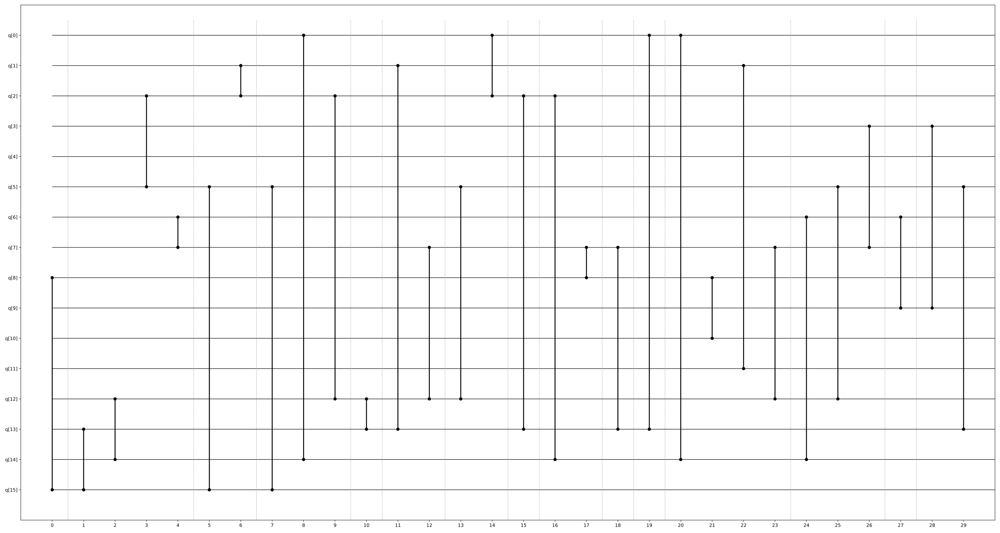
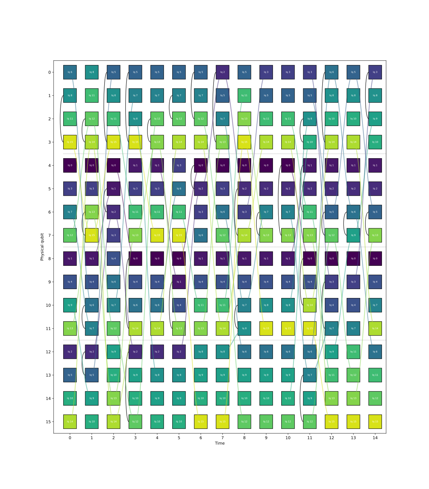

# Implementation of: _Attention-Based Deep Reinforcement Learning for Qubit Allocation in Modular Quantum Architectures_

This part of the repository implements [the paper by Russo et. al.](https://arxiv.org/abs/2406.11452)
It also includes some generic quality of life features such as circuit drawing, allocation drawing,
calculation of a solution's cost, solution validation, etc.

In general the code is well documented, but I will provide some guidelines on how to use it.
To understand the functionalities more in-depth please refer to the demos and class documentation.

# Directory structure

The code is contained in the `src` folder and organized in the following directories:

* `models`: generic implementations of the algorithms used, i.e. GNN or transformers, with
    tweaks to fit our needs whenever required.
* `alg`: implementation of the core algorithm itself, typically using the generic
    components of the `models` folder.
* `sampler`: abstract base class for a circuit sampler and all derived implementations (for now only
    random circuit sampling is implemented).
* `tests`: this folder contains usage examples of the library, both for training a model and
    result visualization (a bit confusing, tbf).
* `utils`: miscellaneous quality of life features such as model saving and loading, functions for
    visualizing qubit allocations, solution validation, etc. As we develop more implementations it
    is interesting to move this into the root folder of the project so that it is available for
    everybody.

# How to train a model

The function `trainDemo` in `src/tests/traintests.py` contains a simple example of how to generate
and train a model.

We first need to create a circuit sampler object, such as RandomCircuit; the QubitAllocator object,
which encapsulates the entire algorithm described in the paper; and a training algorithm, such as
the provided Reinforce implementation (for now this is the only option, but it could be expanded
in the future).

Then, by calling the `train` method, the algorithm runs with the target parameters.
The results are stored in the `trained` directory.
The directory follows the name convention `{number of logical qubits}lq_{date as yymmdd}_{hour as hhmmss}`.
This directory contains periodic checkpoints of the model at regular intervals (specified when calling
the train method), as well as the average reward at testing.

# How to display the results

There are two core plotting functionalities: plotting circuits and plotting allocations.
As it name suggests, plotting a circuit generates a diagram with vertical lines indicating the
edges between time slices.
The format of the function expected by the function is the same as the one returned by the samplers,
refer to its documentation for more details.
An example of a circuit drawing is shown below.
The _y_ axis corresponds to the logical qubits and the _x_ axis to time.
Solid vertical lines correspond to gates acting on the qubits at the extremes, whereas dashed lines
corresponds to time interval separations.

Qubit allocation plotting shows, for each time slice, the allocation of each logical qubit (whose
number is written inside the box) to a physical qubit (labelled on the _y_ axis).
Different cores are divided with a dashed line, so the example shown below is a two-core
architecture where each core has two physical qubits: the first has qubits 0 and 1; and the second
qubits 2 and 3 (not to be confused with the numbering of logical qubits).
Whenever a gate acts on two logical qubits there is a solid black line joining them.
Take for example logical qubits 1 and 2 (physical qubits 0 and 1) on the second time slice.
Whenever a qubit is swapped there is a line connecting its old and new positions in the time slices.

